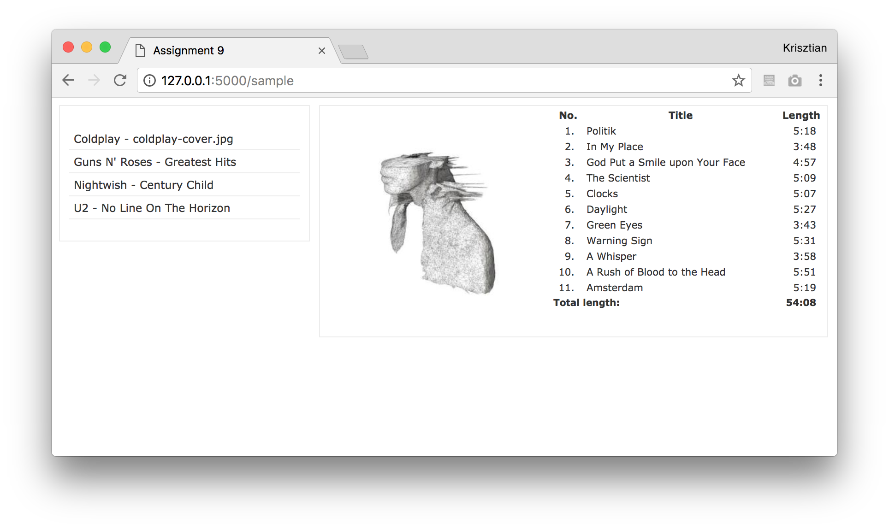

# Assignment 7 - AJAX

**Info: You can use fetch, async/await, or XMLHTTPRequests in this assignment, which ever suits you best.**

Your task is to create a simple web application using AJAX that allows users to browse music albums.

  *	When the user opens the page a list of music albums is displayed. The right panel (`album_info` div) is initially empty.
  *	When clicking on an album, the following needs to be displayed in the right panel (in the `album_info` div):
    -	The album cover
    -	The track list (track number, title, length)
    -	The album's total length (in mm:ss format)
  *	All these operations have to use AJAX, that is, without reloading the entire page. The server-side Python app must send the data in JSON format.

You are provided with two skeletons of the solution. 
- One in folder `7_js` is meant to create a pure JS solution.
- One in folder `7_vue` is meant to create a solution using Vue.

Both skeletons contain the following files:

  *	`static/index.html` is the page that gets rendered when visiting http://127.0.0.1:5000. You don't need to make changes to this file.
  * `static/index_static.html` is just a static example, which you can see under http://127.0.0.1:5000/sample. It shows how the page should look like once the user has clicked on an album.

  *	`static/style.css` is a style file (can be customized, but it's not part of the task)
  * `app.py` is the Python server-side application.  
    - It includes a class for representing the list of albums. You need to complete the missing parts such that it loads data from the `data/albums.txt` and `data/tracks.txt` files.  You can decide what internal data structure you want to use for storing the data.
    - It is already implemented that a single instance of the Albums class is used, so that loading from the files happens only once (and not for each request).

`7_js` contains additionally:
  *	`scripts.js` is where all JavaScript code should go. You need to parse the JSON responses and update the contents of the corresponding div-s of the index.html file.

`7_vue` contains additionally:
  * `albumInfo.js` a start on the `album-info` component.

Additional information:

  *	You may use JavaScript or vue.js on the client side.
  *	The data files are under the data folder in tab-separated format. The tracks within an album should be displayed in the same order as in the file. The order of the albums does not matter.
  *	Supply your application with sample data. Include at least 5 albums with at least 10 songs in each (i.e., you can keep the sample data if you want, but you need to add at least 3 more albums still). Put the album covers inside the `static/images` folder.
  * Indicate in the `README.md` file, if you want to submit the application in `7_js` or `7_vue`.

